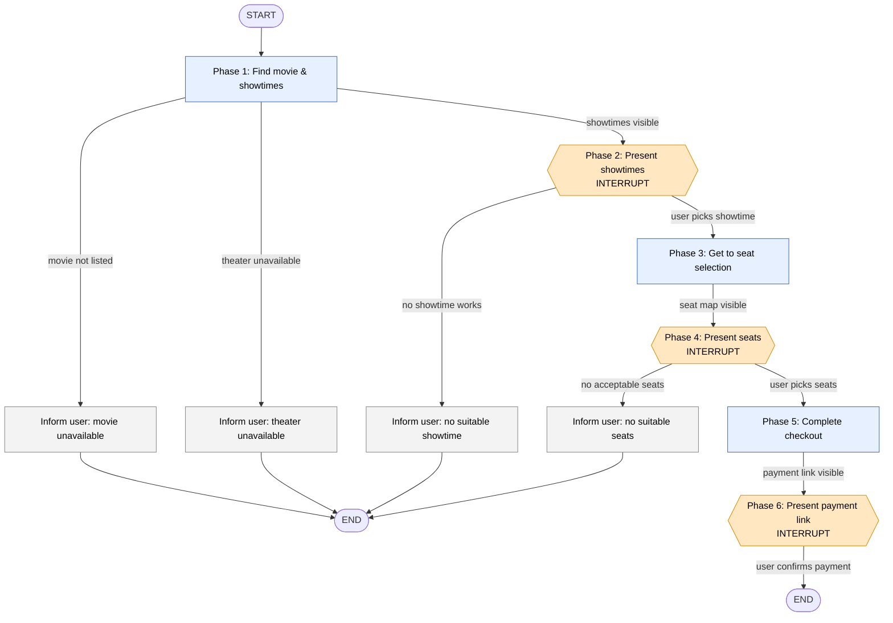

# Phase-Based Booking Architecture

> **Status:** target architecture / design proposal. The Cine Colombia booking flow is **not yet
> implemented** in code — today the agent is a single generic ReAct loop (see
> [How it maps onto the existing code](#5-how-it-maps-onto-the-existing-code)). This document
> supersedes the step-by-step diagram in [`workflow.png`](./workflow.png) as the design we will build
> against.

## 1. Context & problem

The prior design ([`workflow.png`](./workflow.png)) models the booking flow as **~25 hardcoded steps**
— "Click the nav bar", "Click Ver horarios", "Click on the date", "Toggle the [+] button twice" — plus
**4 human interrupts**, the first being a *plan-review* gate ("Ask user to review the plan. Do you
agree?").

Two things are wrong with that shape:

1. **Step-as-node is the wrong altitude.** We already have an autonomous LLM agent that reads a page
   snapshot and decides which browser action to take on its own. It navigated Amazon's search
   end-to-end — found the search bar, typed a query, clicked results — with **zero hardcoded steps**.
   The LLM reads the snapshot, sees a button labeled "Ver horarios", and decides to click it. It does
   not need a node for that. Encoding every click as a graph node throws that capability away and
   yields a brittle 25-node graph whose transitions are fixed in advance and break the moment the site
   changes its layout.

2. **The plan-review interrupt is a "confirm everything" anti-pattern.** When the user has already
   said *"Dune 3, Saturday, Titan Plaza,"* echoing it back as a plan and asking "do you agree?" adds
   friction with no information gain — the agent learns nothing it didn't already have. **It is
   removed.**

The fix is standard agent-planning practice: **hierarchical planning** (decompose the task into a few
high-level stages, let the executor handle the low-level actions) plus **human-in-the-loop only at
genuine decision boundaries**. Concretely: **separate phases from steps.**

- **Phases** are the high-level stages of the task with clear boundaries. They are the *only* things
  that become graph nodes.
- **Steps** are the individual browser actions inside a phase. The LLM handles those autonomously with
  the tools it already has.

~25 step-nodes collapse to **6 phase-nodes**.

## 2. Principle: phases vs. steps

The architecture has two layers, and keeping them separate is the whole point:

| Layer | Owns | Who drives it | Determinism |
| --- | --- | --- | --- |
| **Outer: phase graph** | Phase order, interrupts, early-exit/terminal edges | The graph (us) | Deterministic |
| **Inner: ReAct loop** | The clicks, scrolls, snapshots, and typing within a phase | The LLM | Autonomous |

Each phase declares an explicit **"ends when"** condition — the boundary the LLM drives the page toward.
The LLM loops `get_snapshot → decide → click/type → get_snapshot …` as many times as it needs; the
phase is done when its "ends when" predicate is satisfied. A phase may also have **terminal early-exit
edges** for the unhappy paths the diagram drew (movie not listed, theater unavailable, no acceptable
seats → inform the user → END).

This is why we only create explicit nodes for **phase boundaries** and **interrupt points** — not for
"click this, click that".

## 3. The six phases

> Example shape, mapped from the diagram. It is deliberately *not* a literal 1:1 of every red box —
> the boxes inside a phase are steps the LLM performs on its own.

### Phase 1 — Find the movie and its showtimes
- **LLM does:** navigate to cinecolombia, dismiss the career/cookie popup, find the requested movie
  (scrolling as needed), open it, click "Ver horarios", select the requested date, locate the
  requested theater(s), and reveal the showtimes. If both theaters are available pick the default; if
  only one is, pick that one.
- **Ends when:** showtimes for the requested date + theater are visible on screen.
- **Early exits:** movie not in the list → inform user → **END**; theater not available → inform user
  → **END**.

### Phase 2 — Present showtimes → **INTERRUPT**
- Surface the available showtimes to the user. User picks one.
- **Early exit:** no showtime works for the user → **END**.

### Phase 3 — Get to seat selection
- **LLM does:** click the chosen showtime, handle "Comprar sin registrarse", navigate to the seat map.
- **Ends when:** the seat map is visible.

### Phase 4 — Present seats → **INTERRUPT**
- Surface the sections / available seats. User picks a section and seats.
- **Early exit:** no seats available, or none the user likes → **END**.

### Phase 5 — Complete checkout
- **LLM does:** select the chosen seats, toggle the "Cantidad" `[+]` control, click "Boletos" →
  "Siguiente" → "Continuar", **fill the form from `Settings` (not the conversation)** with name,
  lastname, email, and DNI, click "Pago", and choose "Pago con Tarjeta Débito/Crédito".
- **Ends when:** the payment link is visible.

### Phase 6 — Present payment link → **INTERRUPT**
- Deliver the payment link plus an order summary. User receives it and confirms payment. **END.**

## 4. Interrupts: 4 → 3

We keep human-in-the-loop only where the agent genuinely needs input it **cannot infer** — the real
branch points. We drop the one that only asks the user to repeat themselves.

| Interrupt | Old design | New design | Rationale |
| --- | --- | --- | --- |
| Plan review ("do you agree?") | ✅ present | ❌ **removed** | Confirm-everything anti-pattern; the user already specified movie/date/theater. No information gain. |
| Pick a showtime | ✅ | ✅ kept | Real decision boundary — the agent cannot guess which screening the user wants. |
| Pick section & seats | ✅ | ✅ kept | Real decision boundary — seat preference is the user's to make. |
| Confirm payment link | ✅ | ✅ kept | The handoff to a human-completed action (payment). |

Result: **3 interrupts**, each a genuine decision boundary.

## 5. How it maps onto the existing code

This redesign is implementable on top of what already exists — most of the hard parts (resumable
state, browser tools, per-thread isolation) are already in place. What's needed is the outer phase
graph and the resume path.

### Outer graph (new)
Replace the single flat `create_agent` call in `src/paddington/agent/agent_loop.py:146` with a
LangGraph **`StateGraph`** that has one node per phase plus conditional edges for the early exits and
`END` terminals. Human-in-the-loop uses LangGraph's **`interrupt()`** inside the Phase 2 / 4 / 6 nodes;
the run is resumed with **`Command(resume=<user choice>)`**.

- The **Postgres checkpointer** that already persists thread state (`agent_loop.py:163`,
  `AsyncPostgresSaver`) is exactly what carries the conversation across an `interrupt()` — no new
  persistence layer is needed.
- The route already scopes `thread_id` per user (`src/paddington/routes/agent.py:45`,
  `scoped_thread_id = f"{current_user.id}:{client_thread_id}"`), so resuming the right paused run is a
  matter of looking it up by thread.
- **New wiring required:** `routes/agent.py` currently only forwards a `message`. To resume a paused
  interrupt it must also accept and forward a **resume value** (the chosen showtime / seats / payment
  confirmation) into `Command(resume=…)`.

### Inner execution (reuse)
Each phase node **reuses the current ReAct agent** — the same `create_agent` and the same browser
tools (`navigate_to`, `get_snapshot`, `click`, `input_text`, `take_screenshot` in
`src/paddington/browser/tools.py`). The only change is that each phase gets a **phase-specific system
prompt + "ends when" goal** instead of one global prompt (today's single
`_DEFAULT_SYSTEM_PROMPT`, `agent_loop.py:22`). Existing machinery carries over unchanged:
- `BudgetMiddleware` (`agent_loop.py:267`) — per-turn cost ceiling.
- Dangling-tool-call repair (`agent_loop.py:97`) — keeps history valid across interruptions.

### Proposed state (new, not yet in code)
A `BookingState` `TypedDict` threads collected data between phases:

```python
class BookingState(TypedDict):
    messages: Annotated[list[BaseMessage], add_messages]
    phase: str                       # "find_showtimes" | "seat_selection" | "checkout" | ...
    # collected as phases complete:
    movie: str
    date: str
    theater: str
    chosen_showtime: str | None      # set by the Phase 2 interrupt
    chosen_seats: list[str] | None   # set by the Phase 4 interrupt
    payment_link: str | None         # set by Phase 5
```

> Marked as a proposal — `BookingState` does not exist in the code today; the current loop uses the
> default message-only LangGraph state.

## 6. PII → Settings

Booking PII moves **out of the conversation** and **into configuration**. Per the booking flow, Phase 5
fills the checkout form, but the values come from `Settings`, not from chat. This keeps personal data
off the transcript and out of the LLM's context.

Add a booking-profile block to `src/paddington/config.py` `Settings` (read from `.env`, following the
existing Pydantic `BaseSettings` pattern — `config.py` already loads everything else from `.env`):

```python
# Booking profile (used by Phase 5 to fill the checkout form)
booking_full_name: str = Field(default="", description="First name(s) for the ticket form")
booking_last_name: str = Field(default="", description="Last name(s) for the ticket form")
booking_email: str = Field(default="", description="Email for the ticket form")
booking_dni: str = Field(default="", description="National ID (DNI) for the ticket form")
```

Then add the same keys to `.env.example`.

**Security posture:** these values are PII. Keep them out of structured logs (the codebase already logs
with structured fields rather than interpolating values, so don't add them to any `logger.*` call), and
do not echo them back into the chat transcript or the agent's message history. Phase 5 reads them
directly at form-fill time.

## 7. The graph



**6 phase nodes** (P1–P6), **3 interrupts** (P2, P4, P6), **3 terminal early-exits** plus the
happy-path `END`.

## 8. What changes vs. the prior design

| Dimension | Prior design (`workflow.png`) | This architecture |
| --- | --- | --- |
| Graph nodes | ~25 hardcoded step-nodes | 6 phase-nodes |
| Transitions | predetermined, per click | LLM-driven within a phase; graph owns only boundaries |
| Interrupts | 4 (incl. plan review) | 3 (plan review removed) |
| PII (name/lastname/email/DNI) | typed into the form / carried in conversation | read from `Settings` (`.env`) at Phase 5 |
| Brittleness | breaks on any layout change | resilient — the LLM re-reads the live snapshot each step |
